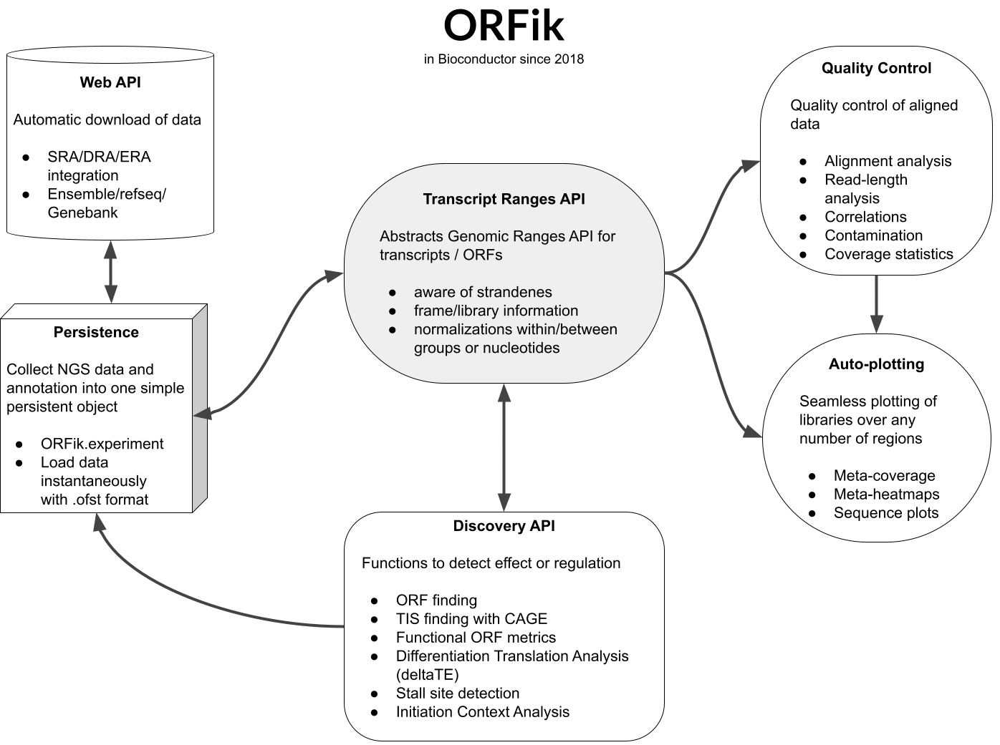

ORFik: R package for discovery of novel genes.
==============================================================================



This package is still under development, although this version is stable and can be used.

#### About


ORFik is a R package containing various functions for analysis of Ribo-Seq, RNA-Seq, CAGE and TCP-seq data related to transcriptomics. ORFik currently supports:

1. Finding Open Reading Frames (very fast) in the genome of interest or on the 
set of transcripts/sequences.  
2. Hundreds of functions helping your analysis of either: sequence data, RNA-seq data, CAGE data, Ribo-seq data, TCP-seq data or RCP-seq data.
3. Automatic estimations of RiboSeq footprint shift.  
4. Utilities for metaplots of RiboSeq coverage over gene START and STOP codons 
allowing to spot the shift.  
5. Shifting functions for the RiboSeq data.  
6. Finding new Transcription Start Sites with the use of CAGE data.  
7. Various measurements of gene identity, more than 30 functions. e.g. FLOSS, coverage, ORFscore, 
entropy that are recreated based on scientific publications.  
8. Utility functions to extend GenomicRanges for faster grouping, splitting, filtering etc.
9. Several standardized plots for coverage and metacoverage of NGS data, including smart grouping functions for easier prototyping.
10. Automatic download of genome annotation from any species supported by ensembl.
11. Automatic download and renaming of files from SRA, ERA and DRA. 
12. Trimming data using fastp and alignment using STAR.
13. Simplifying working with massive amounts of datasets using the ORFik experiment class.


#### Installation
Package is available from bioconductor (3.12, R version >= 4.0.0)
```r
if (!requireNamespace("BiocManager", quietly=TRUE))
    install.packages("BiocManager")
BiocManager::install("ORFik")
```

Development version on bioconductor (3.13, R version >= 4.0.0)
```r
if (!requireNamespace("BiocManager", quietly=TRUE))
    install.packages("BiocManager")
BiocManager::install("ORFik", version = "devel")
```  

Package is also available here on github
```r
library(devtools)
install_github("Roleren/ORFik")
```  

#### More information

After installation run:
```r
library(ORFik)

# Tissue specific 5' utrs using cage-data
?reassignTSSbyCage

# Detecting open reading frames
?findORFs

# get a feature-set from predicted orfs
?computeFeatures

# read vignette
browseVignettes("ORFik")
```  

#### Feedback

Please feel free to provide feedback or desired functionality by creating a new issue on our github page.
