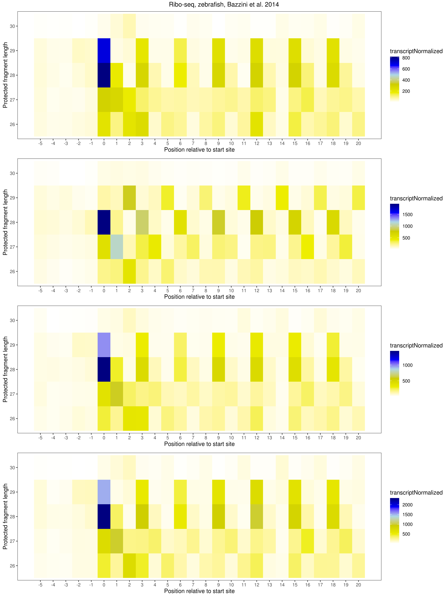

# Introduction

Welcome to the introduction of data management with ORFik experiment. This vignette will walk you through how to work with large amounts of sequencing data effectively in ORFik.
`ORFik` is an R package containing various functions for analysis of RiboSeq, RNASeq, RCP-seq, TCP-seq, Chip-seq and Cage data, we advice you to read ORFikOverview vignette, before starting this one.

## Motivation
NGS libraries are becoming more and more numerous. As a bioinformatician / biologist you often work on multi-library experiments, like 6 libraries of RNA-seq and 6 Ribo-seq libraries, split on 3 conditions with 2 replicates each. Then make some plots or statistics. A lot of things can go wrong when you scale up from just 1 library to many, or even to multiple experiments.

Another problem is also that annotations like gff and fasta files combined with the NGS data, must be separately loaded. Making it possible to use wrong annotation for the NGS data.

So to summarize, the ORFik experiment API abstracts what could be done with 1 NGS library and a corresponding organism annotation to the level of multiple libraries and the comparison between them, standardizing ploting, comparisons, loading libraries and much more.

## What is an ORFik experiment?
It is an object that simplify and error correct your NGS workflow, creating a single R object that stores and controls all results relevant to a specific experiment. It contains following important parts:

- filepaths and info for each library in the experiment (for multiple files formats: bam, bed, wig, ofst, ..) 
- genome annotation files of the experiment (fasta genome, index, gtf, txdb)
- organism name (for automatic GO, sequence analysis..)
- description and author information (list.experiments(), show all experiments you have made with ORFik, easy to find and load them later)
- API: ORFik supports a rich API for using the experiment,like outputLibs(experiment, type = "wig") will load all libraries converted to wig format into R,  loadTxdb(experiment) will load the txdb (gtf) of experiment, 
transcriptWindow() will automatically plot metacoverage of all libraries in the experiment, countTable(experiment) will load count tables, etc..)
- Safety: It is also a safety in that it verifies your experiments contain no duplicate, empty or non-accessible files. Making it almost impossible to load the wrong data. In addition it has other safety checks; comparing chromosome naming of libraries and annotation, making sure there is no mixing of chr1 vs 1 as name for chromosome 1 etc.

# creating an ORFik experiment
Let's say we have a human experiment, containing annotation files (.gtf and .fasta genome) + Next generation sequencing libraries (NGS-data); RNA-seq, ribo-seq and CAGE.

An example of how to make the experiment will now be shown:

First load ORFik
```{r eval = TRUE, echo = TRUE, message = FALSE}
library(ORFik)
```

In a normal experiment, you would usually have only bam files from alignment of your experiment to start with (and split this into 3 experiments, 1 for RNA-seq, 1 for Ribo-seq and 1 for CAGE), but to simplify this for you to replicate we use the ORFik example data.

## A minimal experiment
The minimal amount of information you need to make an ORFik experiment is:

- 1. A folder with NGS data
- 2. A path to transcriptome annotation (gtf->slow or txdb->faster)
- 3. A path to genome (fasta)
- 4. A name for the experiment

```{r eval = TRUE, echo = TRUE}
# 1. Pick directory (normally a folder with your aligned bam files)
NGS.dir <- system.file("extdata/Homo_sapiens_sample", "", package = "ORFik")
# 2. .gff/.gtf location
txdb <- system.file("extdata/references/homo_sapiens", "Homo_sapiens_dummy.gtf.db", package = "ORFik")
# 3. fasta genome location
fasta <- system.file("extdata/references/homo_sapiens", "Homo_sapiens_dummy.fasta", package = "ORFik")
# 4. Pick an experiment name
exper.name <- "ORFik_example_human"


list.files(NGS.dir)
```
Experiments are created by all accepted files from a folder (file extension given by type argument, default: bam, bed, wig, ofst), so remember to keep your experiment folder clean of other NGS libraries of these types not related to the experiment.

```{r eval = TRUE, echo = TRUE}
# This experiment is intentionally malformed, so we first make only a template:
template <- create.experiment(dir = NGS.dir,  # directory of the NGS files for the experiment
                              exper.name,     # Experiment name
                              txdb = txdb,    # gtf / gff / gff.db annotation
                              fa = fasta,     # Fasta genome
                              organism = "Homo sapiens", # Scientific naming
                              saveDir = NULL, # Create template instead of ready experiment
                              )
# The experiment contains 3 main parts:
# 1. Annotation, organism, general info:
data.frame(template)[1:3, ]
# 2. NGS data set-up info:
data.frame(template)[4:8, 1:5]
# 3. NGS File paths:
data.frame(template)[4:8, 6]
```


You see from the template, it excludes files with .bai or .fai, .rdata etc, and only using data of NGS libraries, defined by argument (type).

You can also see it tries to guess library types, stages, replicates, condition etc. It will also try to auto-detect paired end bam files.
## Fixing or updating an experiment
Since every NGS file in a experiment must be a unique set of information columns (
there can not be 2 RNA-seq libraries from wildtype that are replicate1 etc), 
the create.experiment function will intentionally abort if it can not distinguish all the libraries in 
some way. (Example: It might find 2 files that are categorized as RNA-seq replicate 1, but the condtion: 
Wild type vs crispr mutant was not auto-detected), so the files would be non-unique.

To fix the things it did not find (a condition not specified, etc), there are 3 ways: 

- Specify the values manually in create.experiment. Example: condition = rep(c("WT", "Mutant"), each = 3)
- Open the file in Excel / Libre office and edit
- Edit the template (only applies if object was not directly saved, like in this vignette)

Let's update the template to have correct tissue-fraction in one of the samples.
```{r eval = TRUE, echo = TRUE}
template$X5[5:6] <- "heart_valve" # <- fix non unique row (tissue fraction is heart valve)

df <- read.experiment(template)# read experiment from template
```

Normally you read experiments saved to disc, if you made only a template, save it by doing:
```{r eval = FALSE, echo = TRUE}
save.experiment(df, file = "path/to/save/experiment.csv")
```
You can then load the experiment whenever you need it.

## ORFik example experiment

ORFik comes with a example experiment, you can load with:
```{r eval = FALSE, echo = TRUE}
ORFik.template.experiment()
```

# The experiment object
To see the object, just show it like this:
```{r eval = TRUE, echo = TRUE}
df
```

## Accessing library file paths
When you print the experiment object, 
you see here that file paths are hidden, you can access them  like this:
```{r eval = TRUE, echo = TRUE}
filepath(df, type = "default")
```

ORFik has an extensive syntax for file type variants for your libraries: example is
you have both bam, bigwig and ofst files of the same library, used for different purposes.

If you have varying version of libraries, like p-shifted, bam, simplified wig files, you can get
file paths to different version with this function, like this:
```{r eval = TRUE, echo = TRUE}
filepath(df[df$libtype == "RFP", ], type = "pshifted")[2] # RFP = Ribo-seq, Default location for pshifted reads
```

The filepath function uses a reductive search, so that if you specify type = "bigwig", and
you do not have those files, it will point you to the lower level file "ofst". If you don't have
those either, it goes to the default file (usually bam format).
This ensure you will at least load something, it just depends how fast those files are.
It also makes it easy to scale up and generalize you scripts to new experiments.

## Loading data from experiment

### Loading NGS data to environment

There are 3 ways to load NGS data, the first one is to load data into an environment.
By default all libraries are loaded into .GlobalEnv (global environment), you can check what
environment it is output to, by running:
```{r eval = TRUE, echo = TRUE}
envExp(df) #This will be the environment
```

The library names are decided by the columns in experiment, to see what the names will be, do:
```{r eval = TRUE, echo = TRUE}
bamVarName(df) #This will be the names:
```

Now let's auto-load the libraries to the global environment
```{r eval = TRUE, echo = TRUE, warning = FALSE}
outputLibs(df) # With default output.mode = "envir".
```
To remove the outputted libraries:
```{r eval = TRUE, echo = TRUE, warning = FALSE}
# remove.experiments(df)
```

### Loading NGS data as list
The second way gives you a list, where the elements are the NGS libraries.
There are also two ways of loading the list:
```{r eval = TRUE, echo = TRUE, warning = FALSE}
outputLibs(df, output.mode = "envirlist")[1:2] # Save NGS to envir, then return as list
```

```{r eval = TRUE, echo = TRUE, warning = FALSE}
# Check envir, if it exist, list them and return, if not, only return list
outputLibs(df, output.mode = "list")[1:2]
```

### Loading NGS data by fimport
The third way is to load manually, more secure, but also more cumbersome.
```{r eval = FALSE, echo = TRUE, warning=FALSE}
files <- filepath(df, type = "default")
CAGE_loaded_manually <- fimport(files[1])
```

If you use the auto-loading to environment and you have multiple experiments, it might be a chance of non-unique naming, 2 experiments might have a library called cage.
To be sure names are unique, we add the experiment name in the variable name:
```{r eval = TRUE, echo = TRUE}
df@expInVarName <- TRUE
bamVarName(df) #This will be the names:
```

You see here that the experiment name, "ORFik" is in the variable name
If you are only working on one experiment, you do not need to include the name, since
there is no possibility of duplicate naming (the experiment class validates all names are unique). 

Since we want NGS data names without "ORFik", let's remove the loaded libraries and load them again.
```{r eval = TRUE, echo = TRUE}
df@expInVarName <- FALSE
remove.experiments(df)
outputLibs(df) 
```

### Loading Annotation and specific regions

There is also many function to load specific parts of the annotation:
```{r eval = TRUE, echo = TRUE, warning = FALSE}
txdb <- loadTxdb(df) # transcript annotation
```

Let's say we want to load all leaders, cds and 3' UTRs that are longer than 30.
With ORFik experiment this is easy:
```{r eval = TRUE, echo = TRUE}
txNames <- filterTranscripts(txdb, minFiveUTR = 30, minCDS = 30, minThreeUTR = 30)
loadRegions(txdb, parts = c("leaders", "cds", "trailers"), names.keep = txNames)
```
The regions are now loaded into .GlobalEnv, only keeping transcripts from txNames.

## Plotting with ORFik experiments
ORFik supports a myriad of plots for experiments. 
Lets make a plot with coverage over mrna, seperated by 5' UTR, CDS and 3' UTR in one of the 
ribo-seq libraries from the experiment
```{r eval = TRUE, echo = TRUE, warning=FALSE}
transcriptWindow(leaders, cds, trailers, df[9,], BPPARAM = BiocParallel::SerialParam())
```

# P-site shifting experiment
If your experiment consists of Ribo-seq, you want to do p-site shifting.
```{r eval = FALSE, echo = TRUE, warning=FALSE}
shiftFootprintsByExperiment(df[df$libtype == "RFP",])
```
P-shifted ribo-seq will automaticly be stored as .ofst (ORFik serialized for R) and .wig (track files for IGV/UCSC) files in a ./pshifted folder, relative to original libraries. 

To validate p-shifting, use shiftPlots. Here is an example from Bazzini et al. 2014 I made.
```{r eval = FALSE, echo = TRUE, warning=FALSE}
df.baz <- read.experiment("zf_bazzini14_RFP") # <- this exp. does not exist for you
shiftPlots(df.baz, title = "Ribo-seq, zebrafish, Bazzini et al. 2014", type = "heatmap")
```


To see the shifts per library do:
```{r eval = FALSE, echo = TRUE, warning=FALSE}
shifts.load(df)
```

To see the location of pshifted files:
```{r eval = FALSE, echo = TRUE, warning=FALSE}
filepath(df[df$libtype == "RFP",], type = "pshifted")
```

To load p-shifted libraries, you can do:
```{r eval = FALSE, echo = TRUE, warning=FALSE}
outputLibs(df[df$libtype == "RFP",], type = "pshifted")
```
There are also more validation options shown in the Ribo-seq pipeline vignette

# Converting bam files to faster formats

Bam files are slow to load, and usually you don't need all the information
contained in a bam file.

Usually you convert to bed or bigWig files, but ORFik also support 3 formats
for much faster loading and use of data.

## ofst: ORFik serialized format
From the bam file store these columns as a serialized file (using the insane facebook zstandard compression):
seqname, start, cigar, strand, score (number of identical replicates for that read). 

This is the fastest format to use, loading time of 10GB Ribo-seq bam file reduced from ~ 5 minutes to ~ 1 second and ~ 15MB size.
```{r eval = FALSE, echo = TRUE, warning=FALSE}
convertLibs(df, type = "ofst") # Collapsed
```

## bedo: bed ORFik file (to be deprecated!)
From the bam file store these columns as text file:
seqname, start, end (if not all widths are 1), strand, score (number of identical replicates for that read), size (size of cigar Ms according to reference)

The R object loaded from these files are GRanges, since cigar is not needed.

Loading time of 10GB Ribo-seq bam file reduced to ~ 10 seconds and ~ 100MB size.

## bedoc: bed ORFik file with cigar (to be deprecated!)
From the bam file store these columns as text file:
seqname, cigar, start, strand, score (number of identical replicates for that read)

The R object loaded from these files are GAlignments or GAlignmentPairs, since cigar is needed.

Loading time of 10GB Ribo-seq bam file reduced to ~ 15 seconds and ~ 200MB size.

# ORFik QC report
ORFik also support a full QC report for post alignment statistics, correlation plots,
simplified libraries for plotting, meta coverage, ++.


## General report

To optimize the experiment for use in ORFik, always run QCreport, you will then get:

- 1. ofst collapsed reads of the bam files for faster loading (saved in /ofst folder relative to the bam files)
- 2. count tables over mrna, 5' UTRs, CDS and 3' UTRs for all transcripts
- 3. QC plots from experiment (correlation, metacoverage, alignment stats, coverage of (5' UTRs, CDS and 3' UTRs), PCA outlier analysis, ++)
- 4. Statistics summarized in csv files.

### How to run QC:
The default QC report:
```{r eval = FALSE, echo = TRUE, warning=FALSE}
QCreport(df)
```

### How to load optimized output from QC:
Load Count tables for cds (FPKM normalized):
```{r eval = FALSE, echo = TRUE, warning=FALSE}
countTable(df, region = "cds", type = "fpkm")
```

Load Count tables for all mRNAs (DESeq object):
```{r eval = FALSE, echo = TRUE, warning=FALSE}
countTable(df, region = "mrna", type = "deseq")
```

### How to load the QC statistics:
The statistics are saved in /QC_STATS/ folder relative to the bam files as csv files.
To see the statistics, you can do:
```{r eval = FALSE, echo = TRUE, warning=FALSE}
QCstats(df)
```

### How to see the QC plots:
The plots are saved in /QC_STATS/ folder relative to the bam files, 
this folder will contain all plots from the QC, either as pdf or png files
dependent on what you specify in the QC.

```{r eval = FALSE, echo = TRUE, warning=FALSE}
QCfolder(df)
```

## Ribo-seq specific pshifting and QC
To pshift all ribo-seq files in an experiment, do:
```{r eval = FALSE, echo = TRUE, warning=FALSE}
shiftFootprintsByExperiment(df)
```

In addition there is a QC report for Ribo-seq, with some addition analysis of read lengths and frames. This should only be run on when you have pshifted the reads.
```{r eval = FALSE, echo = TRUE, warning=FALSE}
RiboQC.plot(df)
```

# Using the ORFik experiment system in your script
Usually you want to do some operation on multiple data-sets. If ORFik does not include a premade function for what you want, you can make it yourself. If your data is in the format of an ORFik experiment, this operation is simple.

## Note for windows users
Windows multicore support is very weak. It means it usually has a high overhead for starting
multithreaded process (data is copied, not referenced usually).
To make sure everything will flow, it is best to set default multicore setting to
single core.

To do this do: 
```{r eval = FALSE, echo = TRUE, warning=FALSE}
  BiocParallel::register(BiocParallel::SerialParam(), default = TRUE)
```
The rule is, the more data that needs to be copied, the slower windows is compared to Unix systems.

## Looping over all libraries in experiment
Not all functions in ORFik supports abstraction from single library to the experiment syntax. 
Here 4 ways to run loops for the data for these cases are shown:

1. Load all at once (Save to global environment for later use)
```{r eval = FALSE, echo = TRUE, warning=FALSE}
library(BiocParallel) # For parallel computation
outputLibs(df, type = "pshifted") # Output all libraries, fastest way
libs <- bamVarName(df) # <- here are names of the libs that were outputed
cds <- loadRegion(df, "cds")
# parallel loop
bplapply(libs, FUN = function(lib, cds) { 
    return(entropy(cds, get(lib)))
}, cds = cds)

```

2. Load all at once (Do not save to global environment for later use)
```{r eval = FALSE, echo = TRUE, warning=FALSE}
 # Output all libraries, fastest way
cds <- loadRegion(df, "cds")
# parallel loop
bplapply(outputLibs(df, type = "pshifted", output.mode = "list"), 
         FUN = function(lib, cds) { 
    return(entropy(cds, lib))
}, cds = cds)

```

3. Loading by file paths
```{r eval = FALSE, echo = TRUE, warning=FALSE}
files <- filepath(df, type = "pshifted")
cds <- loadRegion(df, "cds")
# parallel loop
res <- bplapply(files, FUN = function(file, cds) { 
    return(entropy(cds, fimport(file)))
}, cds = cds)

```

4. No parallel evaluation (If you do not have a lot of memory)
```{r eval = FALSE, echo = TRUE, warning=FALSE}
files <- filepath(df, type = "pshifted")
cds <- loadRegion(df, "cds")
# Single thread loop
lapply(files, FUN = function(file, cds) { 
    return(entropy(cds, fimport(file)))
}, cds = cds)

```

### Reformat output to data.table (merge column-wise)

Since the output from the above loops will output lists, a very fast conversion to data.table can be done with:
```{r eval = FALSE, echo = TRUE, warning=FALSE}
library(data.table)

outputLibs(df, type = "pshifted")
libs <- bamVarName(df) # <- here are names of the libs that were outputed
cds <- loadRegion(df, "cds")
# parallel loop
res <- bplapply(libs, FUN = function(lib, cds) { 
        return(entropy(cds, get(lib)))
    }, cds = cds)

res.by.columns <- copy(res) # data.table copies default by reference
# Add some names and convert
names(res.by.columns) <- libs
data.table::setDT(res.by.columns) # Will give 1 column per library
res.by.columns # Now by columns
```

### Reformat output to data.table (merge row-wise)

To merge row-wise do:
```{r eval = FALSE, echo = TRUE, warning=FALSE}
res.by.rows <- copy(res)
# Add some names and convert
names(res.by.rows) <- libs
res.by.rows <- rbindlist(res.by.rows) # Will bind rows per library
res.by.columns # now melted row-wise
```

# Conclusion

ORFik contains a whole API for using the ORFik.experiment S4 class to simplify coding over experiments. More examples of use shown 
in documentation and in the Annotation_Alignment and Ribo-seq pipeline vignettes.
